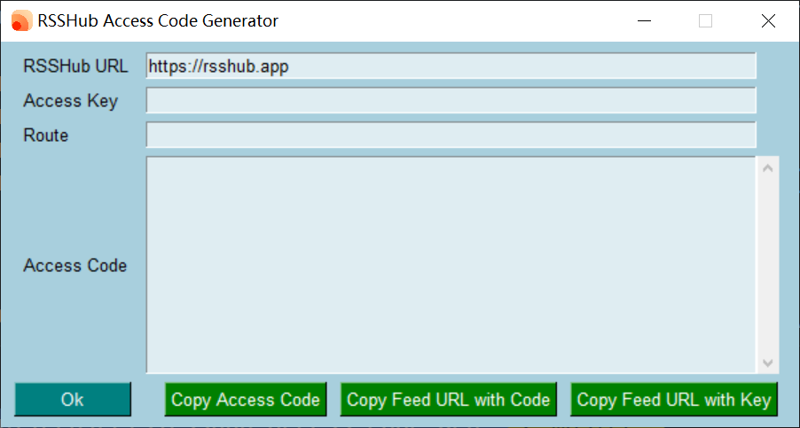

# RSSHub Access Code Generator

An access code generator written in Python for [RSSHub](https://github.com/DIYgod/RSSHub).

See [here](https://docs.rsshub.app/install/#pei-zhi-fang-wen-kong-zhi-pei-zhi) for details.



## Run & Build

1. Install the [PySimpleGUI](https://github.com/PySimpleGUI/PySimpleGUI) before running: `pip install pysimplegui` or `pip3 install pysimplegui`.
2. `python main.py`

**To build an executable file**:

Install the [PyInstaller](https://pypi.org/project/pyinstaller/) first: `pip install pyinstaller`, then run command: 

```bash
pyinstaller -wF main.py
# or with icon
pyinstaller -i RSSHub.ico -wF main.py
```

## Thanks

- [PySimpleGUI/PySimpleGUI](https://github.com/PySimpleGUI/PySimpleGUI)
- The icon is extracted from [DIYgod/RSSHub](https://github.com/DIYgod/RSSHub)

## License

[BSD-3-Clause](./LICENSE)